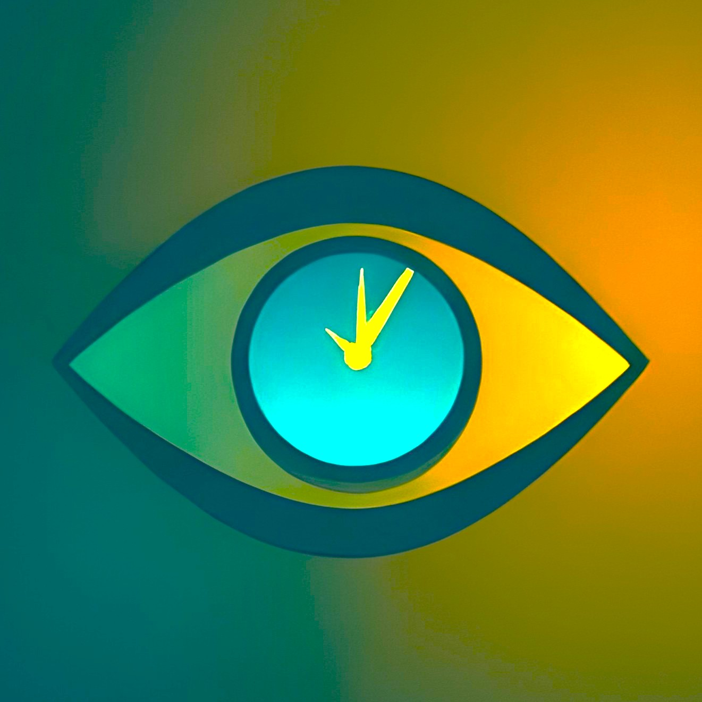
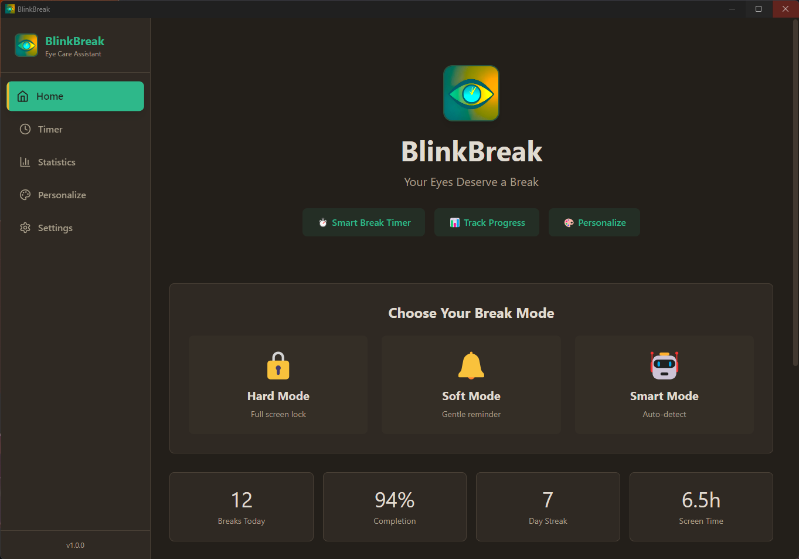
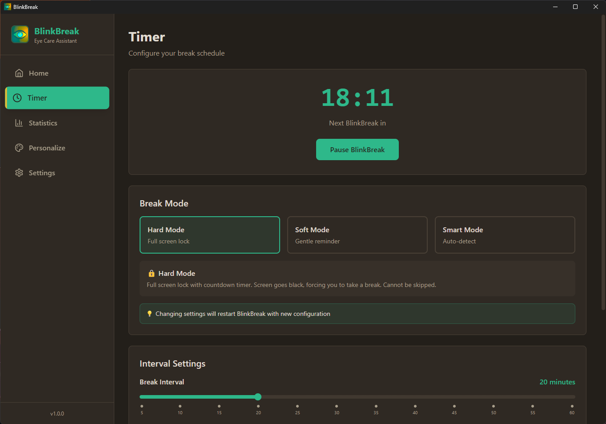

# BlinkBreak

<p align="center">
  
</p>

<p align="center">
  <strong>Your Eyes Deserve a Break</strong>
</p>

<p align="center">
  A desktop application designed to reduce eye strain and promote healthy screen habits through intelligent break reminders and display optimization.
</p>

<p align="center">
  <a href="https://github.com/rahad-hossain/BlinkBreak/releases/latest">
    
  </a>
  
  
</p>

---

## Overview

BlinkBreak is a cross-platform desktop application built with Electron that helps prevent digital eye strain by implementing the 20-20-20 rule and providing customizable break intervals. The application runs in the background and reminds users to take regular breaks, adjust their display settings, and maintain healthy computing habits.

---

## Screenshots

<p align="center">
  
  
</p>

---

## Features

- ✓ **Smart Break Timer** - Customizable intervals (5-60 min) and duration (5-60 sec)
- ✓ **Hard Mode** - Full screen lock on all monitors
- ✓ **Soft Mode** - Gentle popup notification
- ✓ **Multi-Monitor Support** - Covers all displays with different DPI
- ✓ **System Tray** - Runs in background with live timer status
- ✓ **Auto-Launch** - Start with Windows (toggle in Settings)
- ✓ **Settings Persistence** - Timer settings survive restarts
- ✓ **Dual Themes** - Dark Neon (eye-friendly) and White
- ✓ **Single Instance** - Prevents multiple app instances

### Coming Soon
- ○ Statistics tracking (UI ready)
- ○ Smart Mode (meeting detection)
- ○ Health reminders (posture, hydration)
- ○ Monitor controls (brightness, contrast)
- ○ Blue light filter
- ○ Global keyboard shortcuts

---

## Download

**Latest Release:** [v1.0.0](https://github.com/rahad-hossain/BlinkBreak/releases/latest)

**Installer (Recommended):** `BlinkBreak Setup 1.0.0.exe`
- Installs to Program Files with shortcuts

**Portable:** `BlinkBreak 1.0.0.exe`
- No installation required

**Requirements:** Windows 10/11 (64-bit)

---

## Quick Start

1. Download and install BlinkBreak
2. App starts with default: 20 min interval, 20 sec break
3. Customize timer in **Timer** tab
4. App runs in system tray - click to show/hide
5. Enable/disable auto-launch in **Settings**

---

## Building from Source

```bash
# Clone repository
git clone https://github.com/rahad-hossain/BlinkBreak.git
cd BlinkBreak

# Install dependencies
npm install

# Run in development
npm run dev

# Build for production
npm run build
npm run build:electron
```

---

## Technology Stack

- **Electron 28** - Desktop framework
- **React 18** - UI library
- **TypeScript** - Type safety
- **TailwindCSS** - Styling
- **Zustand** - State management
- **electron-store** - Data persistence

---

## Development

### Project Structure
```
BlinkBreak/
├── src/
│   ├── main/           # Electron main process
│   ├── renderer/       # React application
│   ├── preload/        # Preload script for IPC
│   └── shared/         # Shared types and utilities
├── public/             # Static assets
└── dist/               # Build output
```

### Available Commands
```bash
npm run dev             # Start development server
npm run build           # Build all processes
npm run build:electron  # Package for distribution
npm run lint            # Run ESLint
```

---

## Design Principles

BlinkBreak is designed with eye health as the primary focus. The color scheme uses warm tones to reduce blue light exposure, maintains high contrast without harsh whites, and implements reduced saturation to prevent eye fatigue. The interface is minimal and intuitive, with smooth animations that respect user accessibility preferences. All user data is stored locally with no telemetry or external server communication.

---

## Support

- [Report Issues](https://github.com/rahad-hossain/BlinkBreak/issues)
- [View Releases](https://github.com/rahad-hossain/BlinkBreak/releases)
